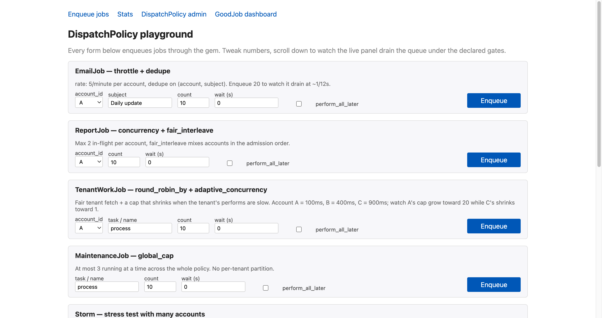
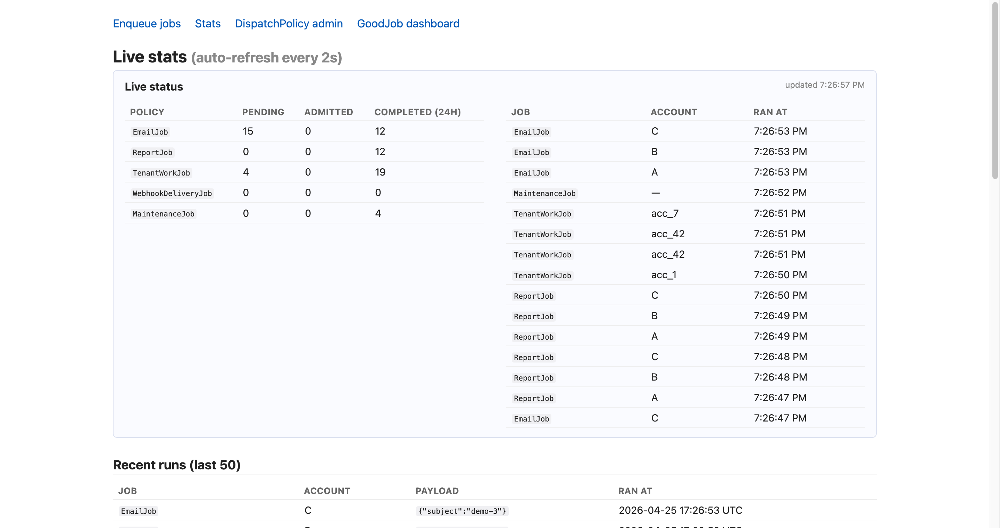
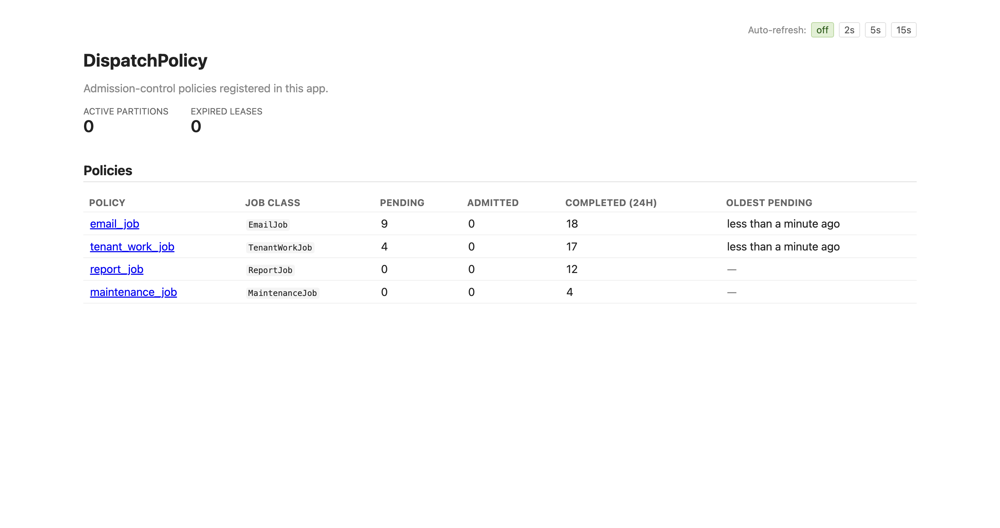
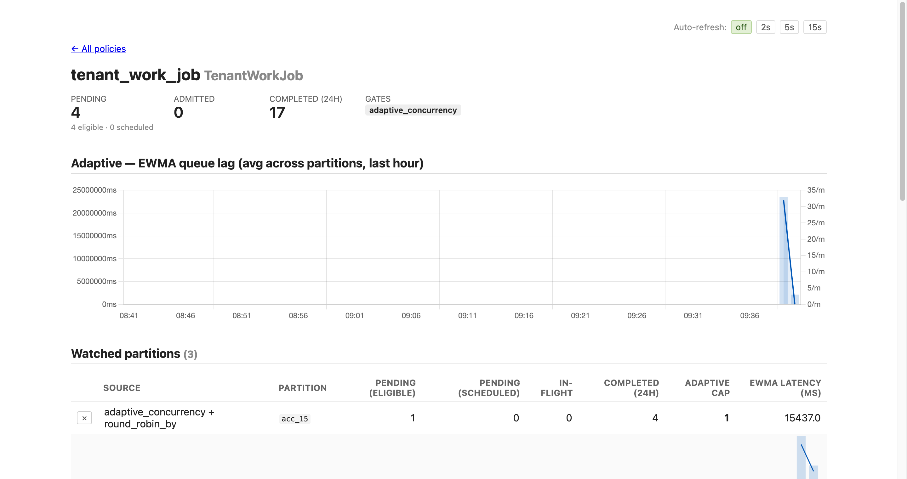

# DispatchPolicy demo

A small Rails 8 app that drives every public feature of the
[dispatch_policy](https://github.com/ceritium/dispatch_policy) gem from a browser.

## What you can do

- `/` — forms to enqueue sample jobs covering every gate:

  | Job | Policy | Feature highlighted |
  |-----|--------|---------------------|
  | `EmailJob` | `throttle` (5/min per account) + `dedupe_key` | token-bucket pacing + idempotency |
  | `ReportJob` | `concurrency` max=2 per account + `fair_interleave` | per-account concurrency, round-robin order |
  | `TenantWorkJob` | `round_robin_by` + `adaptive_concurrency` | LATERAL batch fairness + AIMD cap that self-tunes per tenant |
  | `WebhookDeliveryJob` | `round_robin_by weight: :time` + `adaptive_concurrency` | time-weighted fairness + drip-feed admission, no throttle |
  | `MaintenanceJob` | `global_cap` max=3 | singleton-ish global cap |

  Each form also exposes:
  - `count` — how many jobs to enqueue.
  - `wait (s)` — set a `wait_until`, stages with `not_before_at` in the future.
  - `perform_all_later` checkbox — switches to the batch ActiveJob API.

- `/stats` — live table (auto-refreshes every 3s) of pending / admitted /
  completed counts per policy + the last 50 completed `JobRun`s.

- `/dispatch_policy` — the gem's built-in admin UI: per-policy pending,
  throttle buckets, partition in-flight counters.

- `/good_job` — the GoodJob dashboard for the underlying worker state.

## Run it

```bash
bundle install
bin/rails db:create db:migrate

# Terminal 1 — web
bin/rails s

# Terminal 2 — worker (also runs the cron for the tick safety net)
bundle exec good_job start
# To also see ActiveRecord queries in the worker's stdout:
# RAILS_LOG_TO_STDOUT=1 bundle exec good_job start
```

Visit http://localhost:3000.

## How it works

- `config/initializers/good_job.rb` sets GoodJob as the ActiveJob adapter,
  enables cron, and schedules `DispatchPolicy::DispatchTickLoopJob` every
  10 seconds as a safety net. The tick self-chains, so under normal
  operation one tick is always alive and the cron rarely fires.

- `config/initializers/dispatch_policy.rb` overrides the gem defaults
  (smaller `batch_size`, smaller `round_robin_quantum`, snappier
  `tick_sleep_busy`) so bursts drain visibly on a laptop.

- Each job class writes a row to `job_runs` from `perform`, giving the
  stats page something concrete to show.

## Screenshots

The playground (`/`) — one form per gate, plus a Storm form for stress runs:



The live `/stats` page — counts per policy and the most recent completions:



The gem's admin index, mounted at `/dispatch_policy`:



A policy detail page — pending/admitted/completed totals, EWMA queue-lag
chart, watched partitions with sparklines, and a searchable list of all
partitions:



Other per-policy pages:
[email_job](screenshots/admin-policy-email_job.png) ·
[report_job](screenshots/admin-policy-report_job.png) ·
[maintenance_job](screenshots/admin-policy-maintenance_job.png).

Regenerate everything with:

```bash
bin/rails screenshots:capture
```

The task seeds a believable mix of completed/pending state through the
real DispatchPolicy admission flow (so sparklines and counters aren't
empty) and writes PNGs into `screenshots/`. It uses headless Chrome via
Capybara + Selenium (dev-only gems) — Selenium Manager auto-downloads
chromedriver, you only need Chrome installed locally.

## Try these demos

| Scenario | How |
|----------|-----|
| Throttle | Enqueue 20 `EmailJob` for account A. Watch `/dispatch_policy` — 5 admitted, rest trickle out at ~1 every 12 s. |
| Dedupe | Submit the same EmailJob form twice fast with the same subject and `perform_all_later=off` — second batch dedupes against still-pending rows. |
| Concurrency | Enqueue 10 `ReportJob` for A, then another 10 for B. Admin shows at most 2 admitted per account while pending drains. |
| Round-robin fairness | Enqueue 50 `TenantWorkJob` for A and 5 for B. Stats page shows B completes early — it wasn't stuck behind A. |
| Time-weighted fairness | Enqueue 500 `WebhookDeliveryJob` for `slow` (1s/perform). Watch admission drip-feed (≈ adaptive cap), not 500 jobs at once. Then enqueue 100 for `fast` (100ms/perform): the next tick gives `fast` most of the batch_size budget while `slow` keeps trickling — total compute time stays balanced without a throttle. |
| Global cap | Enqueue 10 `MaintenanceJob`. Only 3 run concurrently regardless of input rate. |
| Scheduled admission | Any form with `wait=30`. Admin shows the pending row with `not_before_at` 30s in the future. |
| Batch stage | Check the `perform_all_later` box. Rails log shows one `INSERT` instead of N. |

## Scope

This app is not meant for deployment. No authentication, no CSRF
protection beyond Rails defaults, no asset pipeline beyond Propshaft.
Run it locally, learn how the gem behaves, then go ship something real.
